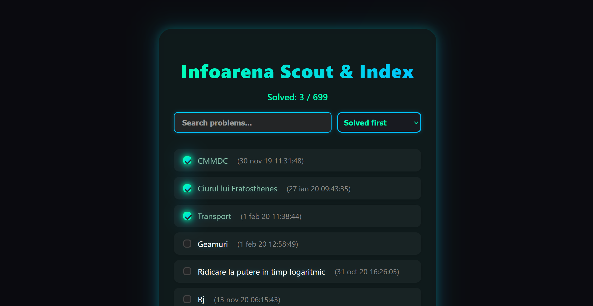
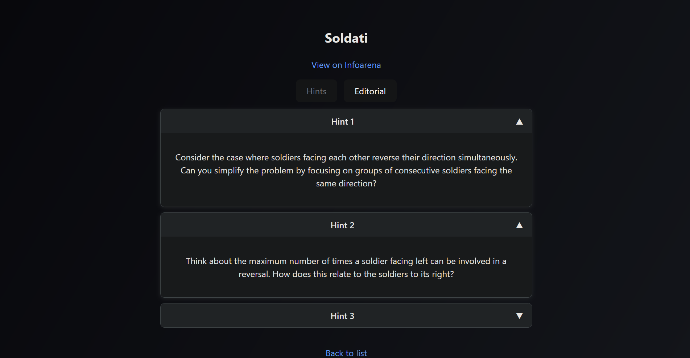
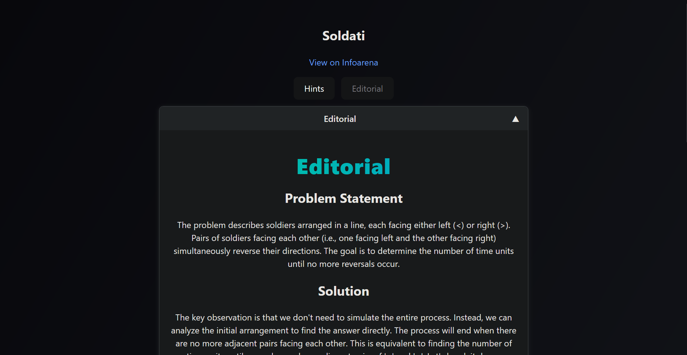

# Infoarena Scout & Index

A modern, beautiful tracker and CLI for Infoarena problem solving progress that follows the solving timeline of another
user.




## Screenshots

**Hints Accordion Example:**



**Editorial Markdown Example:**




## Features

- **AI-Powered Hints & Editorials**: For each problem, the backend uses Google Gemini LLM to generate:
	- 3+ helpful hints (in Romanian or English, depending on system prompt)
	- A detailed editorial, with Markdown formatting and math/code blocks
- **System Prompt Customization**: The LLM system prompt can be set in the backend for language/tone control.
- **Markdown Rendering**: Editorials and hints are rendered as Markdown in the UI for beautiful formatting (code, math, lists, etc).
- **Accordion UI for Hints/Editorials**: Hints and editorials are shown in collapsible accordions for easy reading.
- **Go CLI**: Fetches all 100-point Infoarena monitor entries for a user, outputs a CSV with both problem and solution links.
- **Web Tracker UI**: React-based, neon-themed, with checkboxes for tracking solved problems.
- **Persistent Progress**: Solved state is saved across all usernames and sessions.
- **Advanced Filtering & Sorting**: Search, sort by solved/unsolved, A-Z, Z-A, and time.
- **Modern UX**: Responsive, visually satisfying, and easy to use.
- **Robust Infoarena Scraping**: Improved scraping logic for problem statements and solutions, with error handling.
- **Modular Go Backend**: All helpers and logic are now in an internal Go package for maintainability.
- **Frontend/Backend Separation**: React frontend and Go backend communicate via REST API.

## Quick Start

### 1. Build the CLI

```sh
go build -o bin/iasi.exe cmd/main.go
```

### 2. Start the Tracker (UI & Backend)

```sh
bin/iasi.exe run <username>
```

- This command starts both the Go backend API and the React tracker UI servers.
- The tracker UI will open at [http://localhost:5173](http://localhost:5173)
- The Go backend API is at [http://localhost:8080](http://localhost:8080)

### 2.1. Set up Gemini API Key (for AI features)

To enable AI-powered hints and editorials, you must set your Gemini API key as an environment variable before running the backend:

**On Windows PowerShell:**
```powershell
$env:GEMINI_API_KEY="your-key-here"
```

Replace `your-key-here` with your actual Gemini API key. You can get a key from Google AI.

- You must run this command before starting the backend with `bin/iasi.exe run <username>`.
- For permanent setup, add it to your user or system environment variables.

### 3. Use the Web UI
- Check/uncheck problems to track your progress.
- Use the search and sort controls for fast navigation.
- Progress is saved in your browser and shared across all usernames.

## Project Structure

```
iasi/
├── bin/                # Compiled CLI binary
├── cmd/main.go         # Go CLI and backend
├── data/               # CSV exports
├── web/tracker-app/    # React frontend (Vite + TypeScript)
└── README.md           # This file
```

## Development

### Frontend
```sh
cd web/tracker-app
npm install
npm run dev
```

### Backend
- See Go CLI instructions above.


## License
MIT
